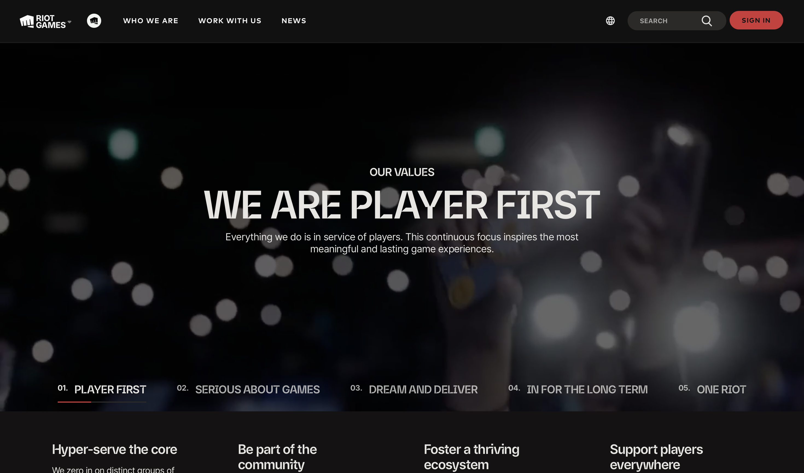
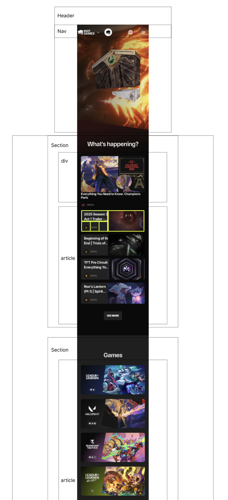
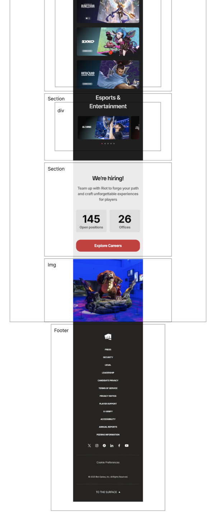
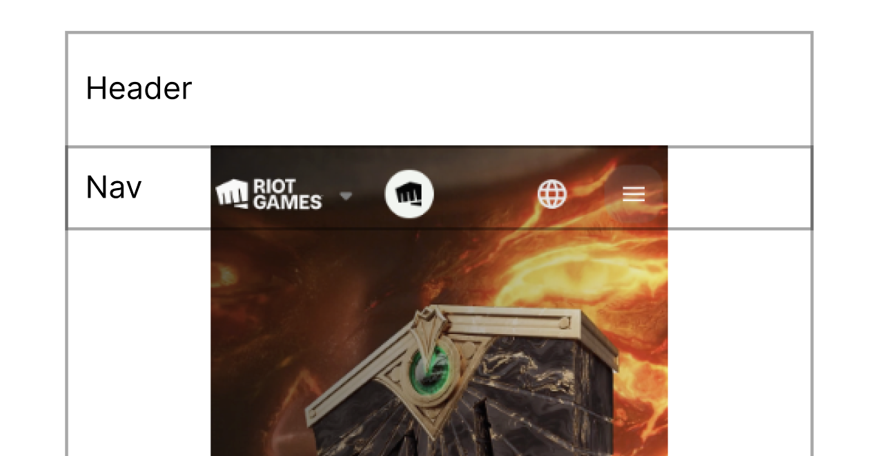
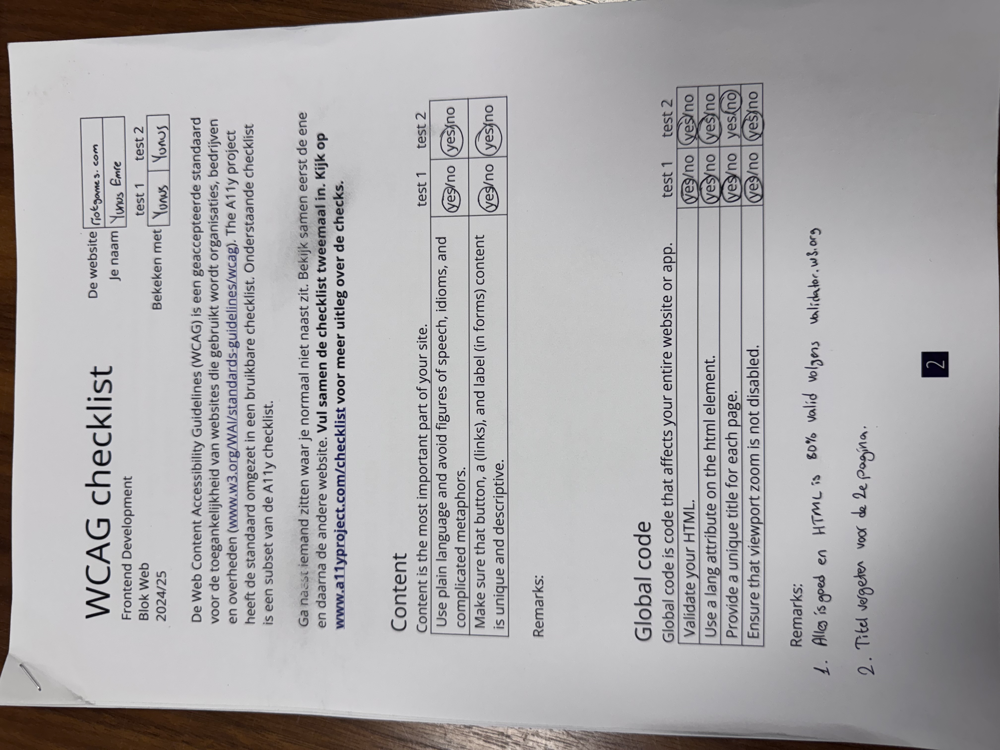
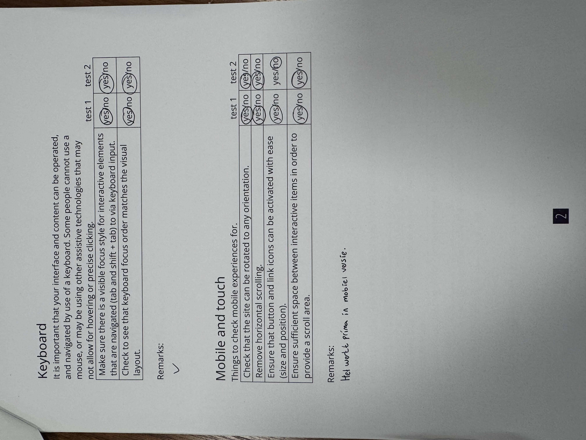
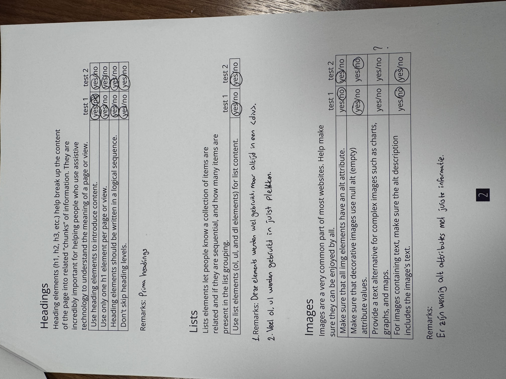
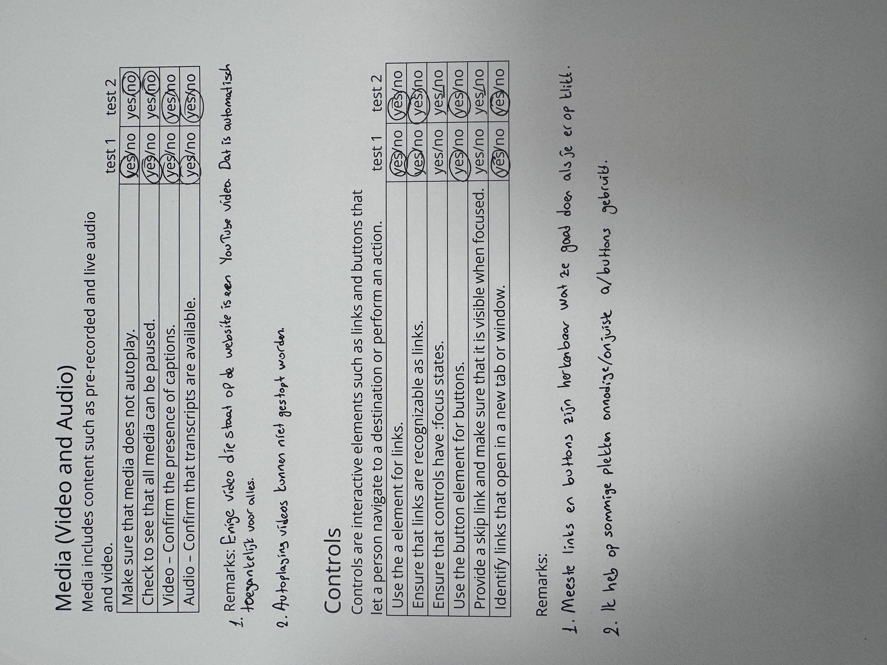
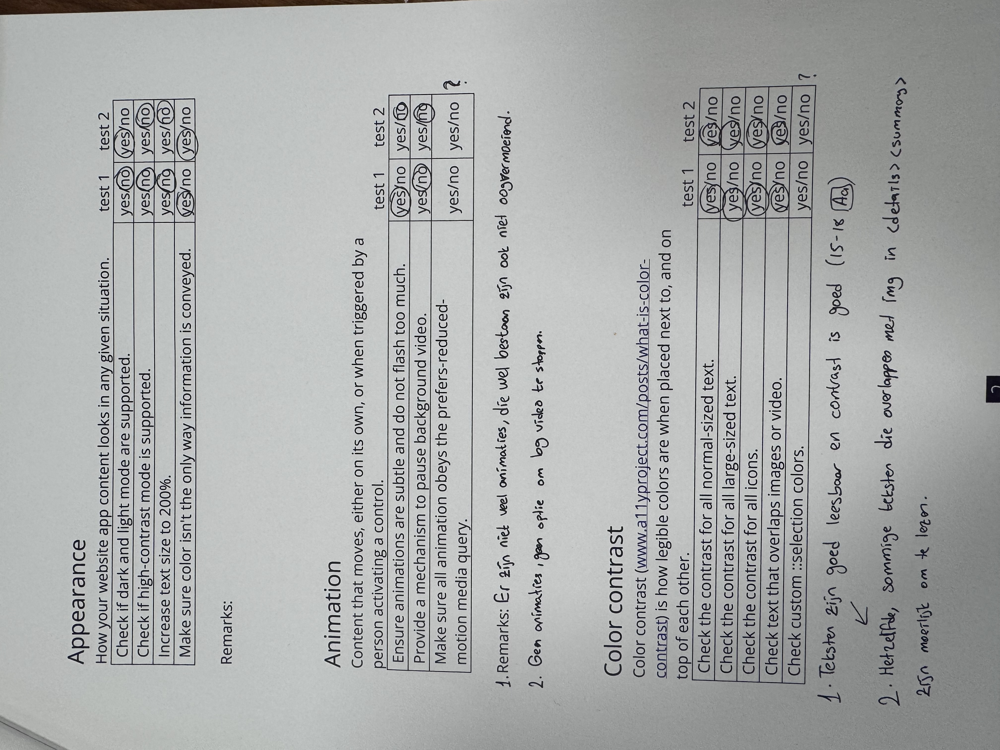

# Procesverslag
Markdown is een simpele manier om HTML te schrijven.  
Markdown cheat cheet: [Hulp bij het schrijven van Markdown](https://github.com/adam-p/markdown-here/wiki/Markdown-Cheatsheet).

Nb. De standaardstructuur en de spartaanse opmaak van de README.md zijn helemaal prima. Het gaat om de inhoud van je procesverslag. Besteedt de tijd voor pracht en praal aan je website.

Nb. Door *open* toe te voegen aan een *details* element kun je deze standaard open zetten. Fijn om dat steeds voor de relevante stuk(ken) te doen.

## Jij

  
uitwerken voor kick-off werkgroep

  ### Auteur:
  Yunus Emre Bayraktar

  #### Je startniveau:
  Rode piste

  #### Je focus:
  Surface plane
 

## Je website

  
uitwerken voor kick-off werkgroep

  ### Je opdracht:
  https://www.riotgames.com/en
  https://www.riotgames.com/en/who-we-are

  #### Screenshot(s) van de eerste pagina (small screen): 
  Home Page
  

  #### Screenshot(s) van de tweede pagina (small screen):
  Who We Are
  
 

## Toegankelijkheidstest 1/2 (week 1)

  
uitwerken na test in 2e werkgroep

  ### Bevindingen
  Lijst met je bevindingen die in de test naar voren kwamen:
  De webstie ziet er goed uit en is wel toegankelijk voor de screenreaders. Wat mij opvalt is dat sommige afbeeldingen niet geschikt zijn voor screenreaders vanwege het ontbreken van alt attributen. En toegankelijkheid voor de high contrast, grootte van de teksten en kleur thema ontbreekt nog.

## Breakdownschets (week 1)

  
uitwerken na afloop 3e werkgroep

  ### de hele pagina: 
  
    

  ### dynamisch deel (bijv menu): 
  

  ### wellicht nog een dynamisch deel (bijv filter): 
  

## Voortgang 1 (week 2)

  
uitwerken voor 1e voortgang

  ### Stand van zaken

  Het maken van structuur van de eerste pagina ging goed. Ik kon wel mijn vragen 
  en ik heb goed feedback gekregen. 

  ### Agenda voor meeting
  samen met je groepje opstellen

  | student 1      | student 2          | student 3    | student 4        |
  | ---            | ---                | ---          | ---              |
  | Gebruik articles voor kaart achtige dingen op je site, dit hoeft geen lijst te zijn.  | Kies een hamburgermenu van de originele website en maak dat na | en ik dit    | en dan ik dat    |
  | Maak gebruik van het "details" element in html voor uitklapbare element.  | dit als er tijd is | nog een punt | dit wil ik zeker |
  | En schrijf eerst al je HTML af voordat je met CSS begint. | ...                | ...          | ...              |

  ### Verslag van meeting
  hier na afloop snel de uitkomsten van de meeting vastleggen

  - details, summary elementen gebruiken voor uitklapbare stukjes
  - eerst de html van beide paginas afmaken
  - articles gebruiken
  - een hamburgermenu kiezen van de originele website

## Voortgang 2 (week 3)

  
uitwerken voor 2e voortgang

  ### Stand van zaken
  Ik heb de feedback van vorige week goed uitgewerkt en probleem gehad met een carousel.
  Het duurde wel een beetje maar eindelijk opgelost.
  ### Agenda voor meeting
  samen met je groepje opstellen

  | student 1      | student 2          | student 3    | student 4        |
  | ---            | ---                | ---          | ---              |
  | Gebruik max-width voor carousel afbeeldingen zodat een klein stukje van de 
  volgende afbeelding zichtbaar is aan de kant van de pagina  | en dit             | en ik dit    | en dan ik dat    |
  | probeer om light/dark mode te maken met custom properties voor surface plane | dit als er tijd is | nog een punt | dit wil ik zeker |
  | ...            | ...                | ...          | ...              |

  ### Verslag van meeting
  hier na afloop snel de uitkomsten van de meeting vastleggen

  - Aanpassingen met carousel
  - Op een juiste manier de elementen van HTML roepen in CSS
  - Bedenken over de light/dark mode
- ...

## Toegankelijkheidstest 2/2 (week 4)

  
uitwerken na test in 9e werkgroep

  ### Bevindingen
  Lijst met je bevindingen die in de test naar voren kwamen (geef ook aan wat er verbeterd is):

  Algemene dingen zijn wel geschikt voor de screenreaders inclusief alt attributen van images. Buttons en a links zijn goed gebruikt. Alleen op een paar plekken heb ik onjuist gebruikt. Voor de achtergrond videos was het niet goed bijgewerkt om de autoplay te laten stoppen.

  Wat verbeterd is dat er een dark/light mode beschikbaar is met een simpele button. Meer semantische elementen worden gebruikt in plaats van overal div's. 

  
  
  
  
  

## Voortgang 3 (week 4)

  
uitwerken voor 3e voortgang

  ### Stand van zaken
  hier dit ging goed & dit was lastig (neem ook screenshots op van delen van je website en code)

  ### Agenda voor meeting
  samen met je groepje opstellen

  | student 1      | student 2          | student 3    | student 4        |
  | ---            | ---                | ---          | ---              |
  | dit bespreken  | en dit             | en ik dit    | en dan ik dat    |
  | en dat ook nog | dit als er tijd is | nog een punt | dit wil ik zeker |
  | ...            | ...                | ...          | ...              |

  ### Verslag van meeting
  hier na afloop snel de uitkomsten van de meeting vastleggen

  - punt 1
  - punt 2
  - nog een punt
  - ...

## Eindgesprek (week 5)

  
uitwerken voor eindgesprek

  ### Je uitkomst - karakteristiek screenshots:
  

  

  ### Dit ging goed/Heb ik geleerd: 
  Ik heb een nieuwe interactie geleerd, namelijk details en summary.
  En nog heb ik met custom properties light/dark mode gedaan.

  
  

  ### Dit was lastig/Is niet gelukt:
  Carousel in carousel was echt moeilijk. Het is me wel gelukt maar ik heb ook hulp van ChatGPT gebruikt.

  

## Bronnenlijst

  
continu bijhouden terwijl je werkt

  Nb. Wees specifiek ('css-tricks' als bron is bijv. niet specifiek genoeg). 
  Nb. ChatGpT en andere AI horen er ook bij.
  Nb. Vermeld de bronnen ook in je code.

  1. Details en summary tutorial https://www.youtube.com/watch?v=Vzj3jSUbMtI, https://www.youtube.com/watch?v=idoaw75xjhU&t=547s
  2. ChatGPT link: https://chatgpt.com/share/68dba57a-2cf8-8005-9829-376821b136bb
  3. ...

